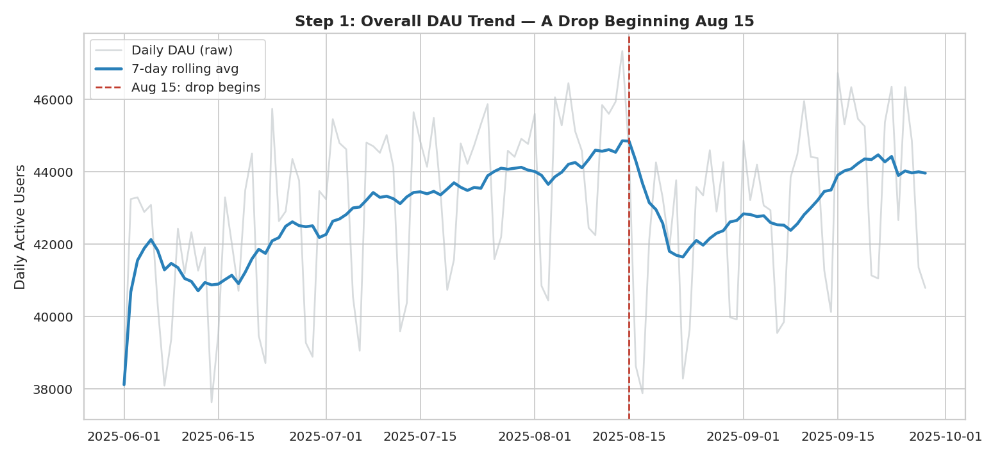
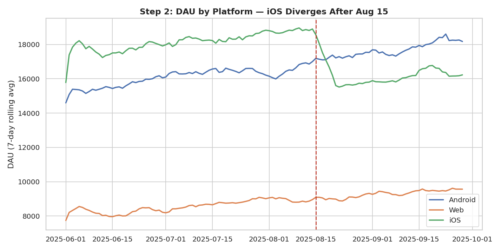
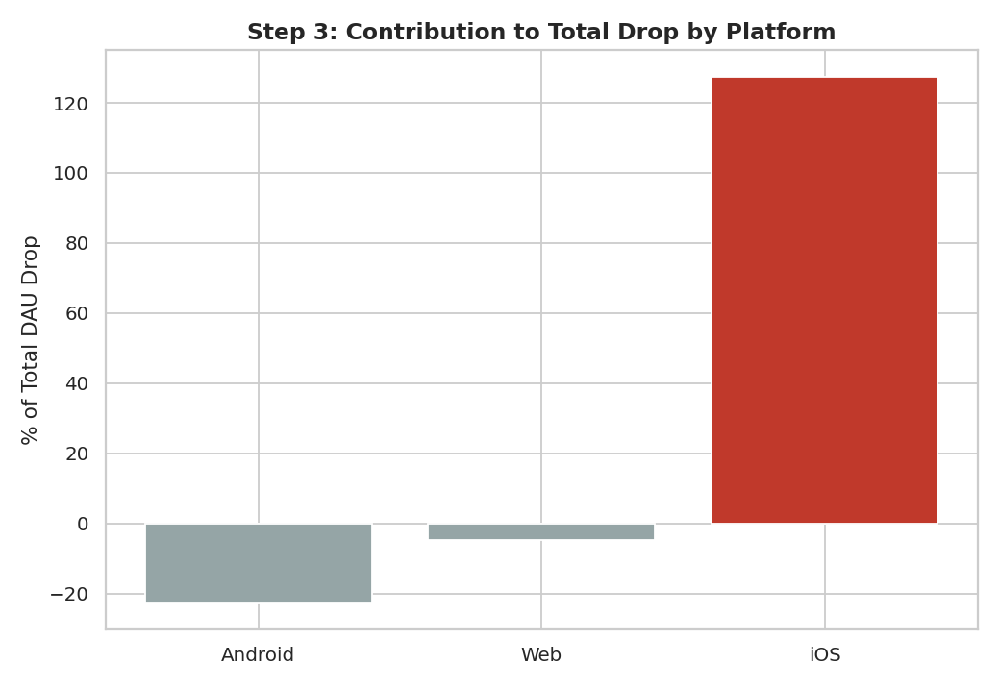
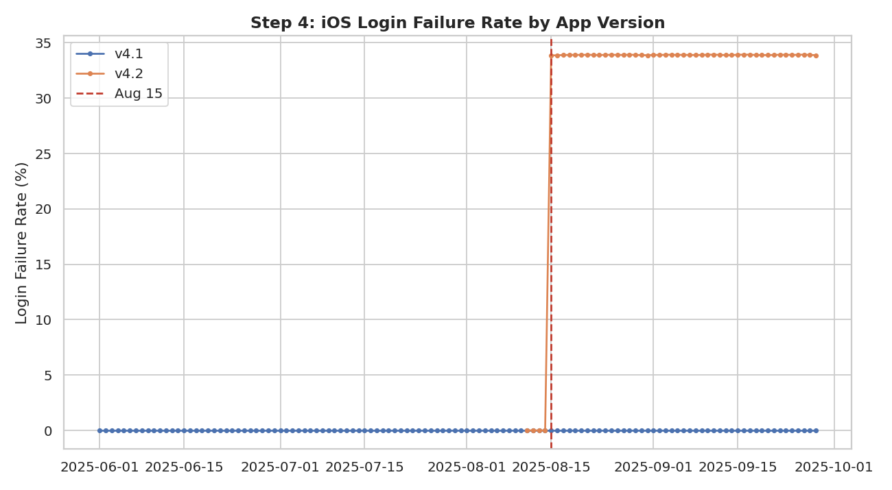

# Diagnosing a DAU Drop - A Root-Cause Investigation

**A structured, end-to-end investigation of a 5.6% daily active user decline, in the format used in analyst case-study interviews at companies like Meta, Google, and Amazon: confirm the metric moved, segment to isolate where, decompose to quantify how much, drill down to find the mechanism, and recommend a fix.**

This project deliberately does **not** start by revealing the root cause. It walks the same investigative sequence a live "your DAU dropped 5% last week — what happened?" interview question expects, using only what each step's data actually shows to decide the next step.

---

## The Investigation

### Step 1 — Confirm the drop is real
Comparing the two weeks before and after Aug 15, 2025:

| Period | Avg DAU |
|---|---|
| Pre (Aug 1–14) | 44,559 |
| Post (Aug 15–28) | 42,052 |
| **Change** | **−5.6%** |

Beyond normal week-to-week noise. Confirmed real, worth investigating further.



### Step 2 — Segment to find where it concentrates
Breaking the same before/after comparison out by platform immediately isolates the problem:

| Platform | Pre DAU | Post DAU | Change |
|---|---|---|---|
| Android | 16,758 | 17,330 | **+3.4%** |
| Web | 8,935 | 9,051 | **+1.3%** |
| **iOS** | 18,866 | 15,671 | **−16.9%** |

Android and Web both grew modestly over the same window. The entire company-wide decline is an iOS problem.



### Step 3 — Decompose contribution to the total drop
iOS's standalone decline (3,195 users/day) is actually **larger** than the net company-wide drop, because Android and Web partially offset it. iOS is not just "the biggest factor" — it's the entire story.



### Step 4 — Drill into iOS: segment by app version
Splitting iOS traffic by app version in the post-period reveals the mechanism immediately:

| App Version | Successful Logins | Failed Logins | Failure Rate |
|---|---|---|---|
| 4.1 | 404,373 | 0 | 0.0% |
| **4.2** | 315,216 | **161,717** | **33.9%** |

Version 4.1 has a clean 0% failure rate throughout. Version 4.2 shows a **33.9% login failure rate**, appearing exactly at the Aug 15 boundary.



### Step 5 — Quantify the impact
- Average failed login sessions/day in the post-period: **3,594**
- Average iOS DAU decline vs. pre-period: **3,195**

These two independently-derived numbers are close enough to confirm the v4.2 login bug is the direct, near-complete explanation for the iOS decline — not a coincidental correlation.

### Step 6 — Rule out confounds
Before concluding, check whether the failure rate is uniform across country (which would point to a client-side bug) or concentrated in specific regions (which would suggest a server/localization/regional infrastructure issue instead):

| Country | Failure Rate |
|---|---|
| US | 33.9% |
| UK | 33.9% |
| DE | 33.8% |
| IN | 33.9% |
| BR | 33.9% |

Uniform across all five countries. This rules out a regional server or localization issue and confirms a **client-side bug specific to app version 4.2**, not something environment- or geography-dependent.

---

## Conclusion & Recommendation

**Root cause:** A login-failure bug shipped in iOS app version 4.2, causing ~34% of login attempts on that version to fail starting Aug 15 — coinciding with a server-side configuration change that triggered previously-dormant client code (a realistic pattern: the bug shipped with the version, but a separate trigger activated it days later).

**Recommendation:**
1. **Immediate:** Force a server-side rollback of the Aug 15 config change, or ship an expedited 4.2.1 patch and force-update affected users.
2. **Process:** This bug was invisible in an aggregate DAU dashboard for days — segmenting by platform and version should be a standard, automated check (not a manual drill-down) triggered whenever the top-line metric moves more than 2-3%.
3. **Monitoring:** Add a login-failure-rate alert, segmented by app version, so a spike like this pages someone within hours instead of surfacing as a lagging DAU decline days later.

---

## Data

Synthetic 120-day session-level dataset (`src/generate_data.py`) for a consumer app, with a deliberately injected root cause (the v4.2 login bug) that the analysis scripts do not have prior knowledge of — the investigation script (`src/investigate.py`) discovers it the same way a real analyst would, by following the data.

| Column | Description |
|---|---|
| `date` | Calendar date |
| `platform` | iOS / Android / Web |
| `country` | US / UK / DE / IN / BR |
| `channel` | Organic / Paid Social / Push Notification / Referral |
| `app_version` | iOS version (4.1 / 4.2); N/A for other platforms |
| `successful_sessions` | Successful login/session count for that slice |
| `failed_login_sessions` | Failed login count for that slice |

## Project Structure

```
metric-drop-investigation/
├── data/
│   ├── daily_sessions.csv
│   └── metrics.db                # SQLite database
├── sql/
│   └── kpi_queries.sql           # Standalone SQL equivalents of each step
├── src/
│   ├── generate_data.py          # Synthetic data + injected root cause
│   ├── load_db.py                # CSV -> SQLite loader
│   └── investigate.py            # The full 6-step investigation
├── outputs/                      # Charts for each investigation step
└── README.md
```

## How to Run

```bash
pip install pandas numpy matplotlib seaborn

python src/generate_data.py
python src/load_db.py
python src/investigate.py    # runs and prints all 6 steps, saves charts
```

## Tools Used

**SQL** (SQLite, conditional aggregation) · **Python** (pandas, matplotlib, seaborn) · **Root-Cause Analysis** (segmentation, contribution decomposition, confound elimination) · **Data Visualization**

---

*Portfolio project on synthetic data with a deliberately injected, undisclosed-to-the-analysis-code root cause, built to demonstrate the structured segmentation-and-drill-down methodology used in analyst case-study interviews and real incident investigations alike.*
